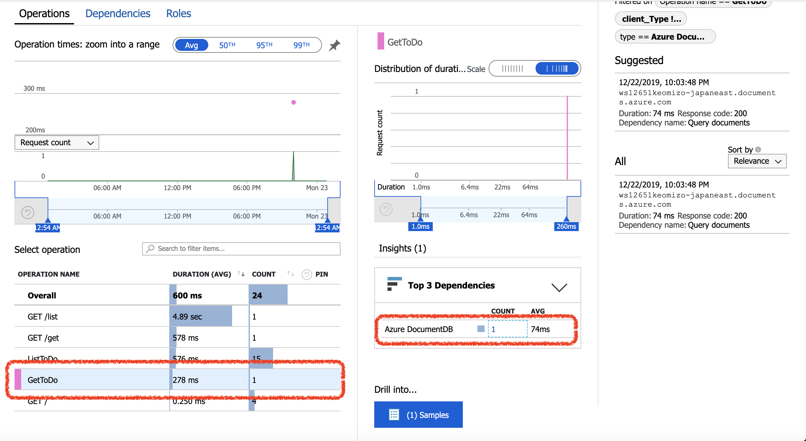
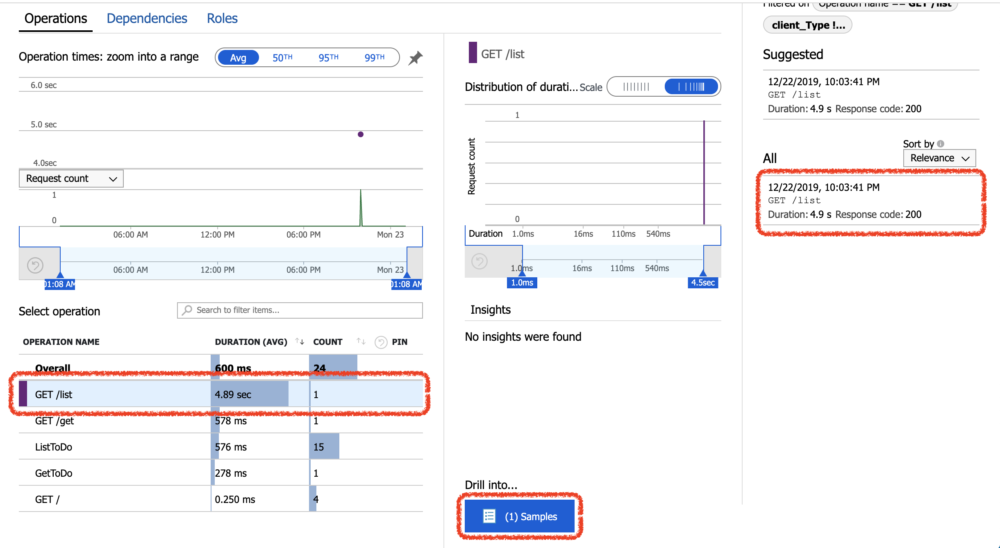
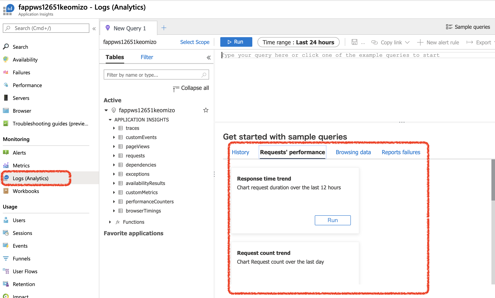
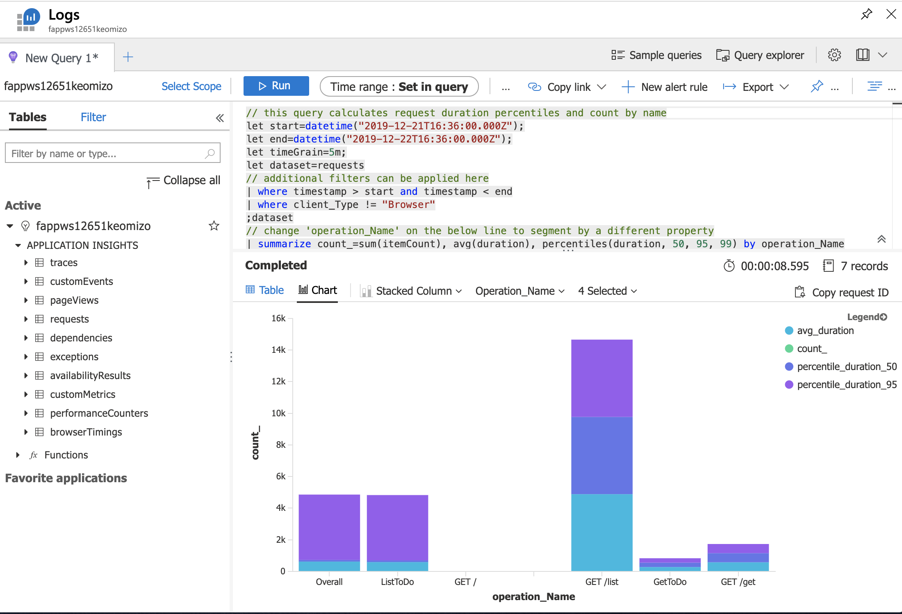

# アプリケーションのパフォーマンスを問題を見つける

Application Insightsを利用して、アプリケーションのパフォーマンスの状況を確認します。

## ステップ1. 時間がかかっている処理を見つける

#### (1) Application Insight 画面の表示

Azureポータル画面にログインし、左Paneのメニューから[Monitor]を選択します。

Azure Monitor画面の左PaneのInsightsセクションの[Application]を選択します。

Application Insights一覧から、対象のApplication Insightsを選択します。

#### (2) パフォーマンスデータの表示
Application Insightsの画面の右Paneで[Performance]を選択する。または、Overviewの画面でのグラフをクリックします。

#### (3) パフォーマンスデータの確認
* Operationタブ : アプリケーションのAPIが呼ばれた数や時間
* Dependencies : アプリケーションが呼び出した他のサービスの呼び出し回数や時間

パフォーマンスデータには、平均実行時間やオペレーションの回数が表示されます。また、そのオペレーションが依存している呼び出しなども参照することができます。

#### (4) 呼び出しのスタックごとのパフォーマンスの確認

Operationsタブで、OPERATION  NAME一覧から、オペレーションを選択し、右Pane下部のDrill into... の下のボタンをクリックします。さらに右に表示されたサンプルをクリックして、エンドツーエンドの呼び出しを確認します。

## ステップ2. サーバーのログを確認する

Application Insightsが収集したログを、高度なクエリ言語で検索することができます。

#### (1) Application Insight 画面の表示

Azureポータル画面にログインし、左Paneのメニューから[Monitor]を選択します。

Azure Monitor画面の左PaneのInsightsセクションの[Application]を選択します。

Application Insights一覧から、対象のApplication Insightsを選択します。

#### (2) Sample Queryの実行

Application Insights画面の左PaneのMonitoringセクションの[Logs(Analytics)]をクリックします。
右Paneに表示されたサンプルクエリを実行します。

#### (3) パフォーマンスに関連するクエリのp実行
Application Insights画面の左PaneでPerformanceをクリックします。
左Paneの上部のView in Logs(Analytics)のプルダウンメニューからみたい項目をクリックしてクエリを実行します。

図は、Requestsのクエリの実行結果です。

