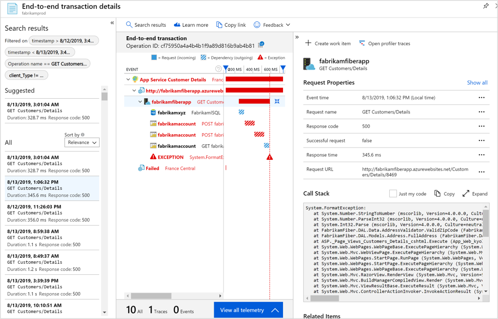

# Find and diagnose performance issues

Azure Application Insights collects telemetry from application to help analyze operation and performance.

> Application Insightsを利用して、アプリケーションのパフォーマンスの状況を確認します。

## Step 1. Identify slow server operations

#### (1) Display Application Insight view

Logged into Azure Portal and choose [Monitor] on the left pane.

On the left pane of Azure Monitor view, choose [Application] from Insights section.

Choose target Application Insights resource from List.

> Azureポータル画面にログインし、左Paneのメニューから[Monitor]を選択します。
>
> Azure Monitor画面の左PaneのInsightsセクションの[Application]を選択します。
>
> Application Insights一覧から、対象のApplication Insightsを選択します。

#### (2) Display performance metrics

Choose [Performance] on the right pane of Application Insights view. Or click a graph on Overview.

> Application Insightsの画面の右Paneで[Performance]を選択する。または、Overviewの画面でのグラフをクリックします。

#### (3) Check performance metrics

* Operation Tab: Shows 'Request Count', 'Operation Time' etc of called Application API.

* Dependencies Tab: Shows 'Dependency response time', 'Depencency count' etc of other services called from appliation.

Display Avarage execution time, Operation count in the Performance pane. In addition to this, show rerated operation.

> * Operationタブ : アプリケーションのAPIが呼ばれた数や時間
> * Dependencies : アプリケーションが呼び出した他のサービスの呼び出し回数や時間
> 
> パフォーマンスデータには、平均実行時間やオペレーションの回数が表示されます。また、そのオペレーションが依存している呼び出しなども参照することができます。

#### (4) Check performance metrics a call stack

Select on one of operation from OPERATION NAME LIST on Operations tab, and cick [Drill into...] button in the bottom right.
This will bring up the end-to-end transaction details

> Operationsタブで、OPERATION  NAME一覧から、オペレーションを選択し、右Pane下部のDrill into... の下のボタンをクリックします。さらに右に表示されたサンプルをクリックして、エンドツーエンドの呼び出しを確認します。

## Step 3. Use log data from Server

Logs provides a rich query language that allows you to analyze all data collected by Application Insights. You can use this to perform deep analysis on request and performance data.

> Application Insightsが収集したログを、高度なクエリ言語で検索することができます。

#### (1) Display Application Insight View

Logged into Azure Portal, and select [Monitor] in the left pane.

Select [Application ] from Insights section in the left pane of Azure Monitor view.

Select on one of Application Insights resource from List.

> Azureポータル画面にログインし、左Paneのメニューから[Monitor]を選択します。
>
> Azure Monitor画面の左PaneのInsightsセクションの[Application]を選択します。
>
> Application Insights一覧から、対象のApplication Insightsを選択します。

#### (2) Execute Sample Query

Select [Logs (Anapytics)] from Monitoring section in the left pane of Application Insights view.

Execute sample query in the right pane.

> Application Insights画面の左PaneのMonitoringセクションの[Logs(Analytics)]をクリックします。
> 右Paneに表示されたサンプルクエリを実行します。

#### (3) Execute query related performance

Select [Performance] in the left pane of Application Insights view.

Select on one of item from [View in Logs(Analytics)] pull-down meny in the left above.

Following images shows result of Requests query.

> Application Insights画面の左PaneでPerformanceをクリックします。
> 左Paneの上部のView in Logs(Analytics)のプルダウンメニューから参照したい項目をクリックしてクエリを実行します。
>
> 図は、Requestsのクエリの実行結果です。

[Agenda](./agenda.md)
